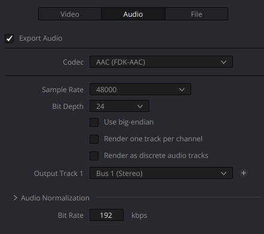

# AAC Audio Encoder Plugin for DaVinci Resolve Studio (Linux)

A high-quality AAC audio encoder plugin for DaVinci Resolve Studio on Linux, using the Fraunhofer FDK-AAC library.
Thanks go to toxblh for the the original concept which inspired this project and also to the team at Claude who assisted in making this plugin possible.
I am hopeful to create more useful plugins and other filter and VST plugins for Davinci Resolve Studio Linux so watch my repositories.  Please let me know how you get on and any suggestions for the future.
Thanks of cource go the BlackMagic for creating the brilliant software that is Resolve.

A note here, please don't ask for aac or other input plugins. BlackMagic have disabled the option of making input plugins for commercial and licensing reasons and I respect their decision to do that. If your looking for a quick way to import mp4 with aac I recomend a small script I created which adds a right click in file explorer nemo which does a quick transcode of the aac to FLAC and remuxes with the passthrough avc video.  Its quick to do an the only option at this point.  I will put that script up on another repo soon.

[](https://www.gnu.org/licenses/gpl-3.0)

## Features

- ✅ **High-quality AAC encoding** using Fraunhofer FDK-AAC
- ✅ **MP4, MOV, and MKV container support**
- ✅ **Configurable bitrate** (128-320 kbps)
- ✅ **Multiple sample rates** (44.1 kHz, 48 kHz)
- ✅ **16-bit and 24-bit audio** support
- ✅ **Native DaVinci Resolve integration**

## Screenshots


*AAC codec available in audio settings*

## Requirements

### Essential
- **DaVinci Resolve Studio** (version 18.0 or later)
  - ⚠️ **Note**: The free version does NOT support plugins
- **Linux x86-64** (Ubuntu, Debian, Arch, Fedora, etc.)
- **Root/sudo access** for installation

### Build Dependencies
- `clang++` or `g++` (C++11 support)
- `pkg-config`
- `libfdk-aac-dev` (Fraunhofer FDK-AAC library)
- DaVinci Resolve Developer SDK (included with Studio)

## Installation

### Quick Install (Recommended)

```bash
# 1. Clone the repository
git clone https://github.com/hexitnz/Resolve-Linux-Studio-AAC-FDK-Encoder-plugin.git
cd Resolve-Linux-Studio-AAC-FDK-Encoder-plugin

# 2. Run the automated installer
chmod +x install.sh
./install.sh
```

The installer will:
- Check for all dependencies
- Install missing packages (with your permission)
- Build the plugin
- Install to DaVinci Resolve
- Verify the installation

### Manual Installation

<details>
<summary>Click to expand manual installation steps</summary>

#### 1. Install Dependencies

**Ubuntu/Debian/Linux Mint:**
```bash
sudo apt update
sudo apt install build-essential pkg-config libfdk-aac-dev clang
```

**Arch Linux:**
```bash
sudo pacman -S base-devel clang libfdk-aac
```

**Fedora:**
```bash
sudo dnf install clang make pkgconfig libfdk-aac-devel
```

#### 2. Build the Plugin

```bash
cd src
make clean
make
```

#### 3. Install to DaVinci Resolve

```bash
sudo make install
```

Or manually:
```bash
sudo cp -r aac_fdk_plugin.dvcp.bundle /opt/resolve/IOPlugins/
sudo chmod -R 755 /opt/resolve/IOPlugins/aac_fdk_plugin.dvcp.bundle
```

</details>

### Post-Installation

**Restart DaVinci Resolve completely:**
```bash
killall resolve
/opt/resolve/bin/resolve
```

## Usage

1. Open **DaVinci Resolve Studio**
2. Go to the **Deliver** page
3. Select your export settings:
   - **Format:** MP4 (or MOV/MKV)
   - **Codec (Video):** Your choice (H.264, H.265, etc.)
   - **Codec (Audio):** **AAC (FDK-AAC)** ← This is the plugin!
   - **Audio Bitrate:** 128-320 kbps (use slider)
4. Add to render queue and export

## Troubleshooting

### Plugin doesn't appear in codec list

**Check installation:**
```bash
ls -la /opt/resolve/IOPlugins/aac_fdk_plugin.dvcp.bundle/Contents/Linux-x86-64/
```

**Verify DaVinci Resolve Studio:**
- The free version does NOT support plugins
- Make sure you have the Studio version installed

**Restart Resolve completely:**
```bash
killall -9 resolve
/opt/resolve/bin/resolve
```

### Build fails with "fdk-aac not found"

**Install libfdk-aac:**
```bash
# Ubuntu/Debian
sudo apt install libfdk-aac-dev

# Arch
sudo pacman -S libfdk-aac

# Fedora (may need RPM Fusion repositories)
sudo dnf install libfdk-aac-devel
```

**Verify installation:**
```bash
pkg-config --modversion fdk-aac
```

### Audio is choppy or distorted

This usually indicates a mismatch between input format and plugin expectations.

**Try these settings in Resolve:**
- Set timeline audio format to 48 kHz
- Use 16-bit or 24-bit audio (avoid float)
- Restart the export

**Check logs:**
```bash
tail -f ~/.local/share/DaVinciResolve/logs/davinci_resolve.log | grep "AAC"
```

### Permission denied errors

**Fix permissions:**
```bash
sudo chown -R root:root /opt/resolve/IOPlugins/aac_fdk_plugin.dvcp.bundle
sudo chmod -R 755 /opt/resolve/IOPlugins/aac_fdk_plugin.dvcp.bundle
```

### No audio in exported file

**Verify the plugin is being used:**
```bash
# Start Resolve from terminal
/opt/resolve/bin/resolve 2>&1 | grep "AAC Plugin"
```

You should see messages like:
```
AAC Encoder :: Constructor
AAC Plugin :: Init - 48000 Hz, 2 ch, 24-bit
AAC Plugin :: Opened - 192 kbps, frame size: 1024
```

If you don't see these messages, the plugin isn't loading.

## Uninstallation

```bash
sudo rm -rf /opt/resolve/IOPlugins/aac_fdk_plugin.dvcp.bundle
```

Then restart DaVinci Resolve.

## Technical Details

### Architecture

The plugin uses:
- **FDK-AAC**: Fraunhofer's high-quality AAC encoder
- **DaVinci Resolve CodecPlugin API**: Official plugin interface
- **Ring buffer**: Accumulates samples to match encoder frame size (1024 samples)
- **Format conversion**: Converts 16/24-bit PCM to float planar, then to int16 for FDK-AAC

### Audio Pipeline

```
Resolve (24-bit PCM)
    ↓
Plugin (convert to float planar)
    ↓
Ring Buffer (accumulate 1024 samples)
    ↓
FDK-AAC (encode to AAC)
    ↓
MP4 Muxer (write to file)
```

### Supported Formats

| Parameter | Values |
|-----------|--------|
| Containers | MP4, MOV, MKV |
| Sample Rates | 44100 Hz, 48000 Hz |
| Bit Depths | 16-bit, 24-bit PCM |
| Channels | Mono (1), Stereo (2) |
| Bitrates | 128-320 kbps |
| Profile | AAC-LC (Low Complexity) |

## Development

### Building for Development

```bash
# Build with debug symbols
cd src
make clean
make CXXFLAGS="-std=c++11 -fPIC -g -Wall -I. -Iinclude"
```

### Project Structure

```
davinci-aac-fdk-plugin/
├── src/
│   ├── aac_encoder.cpp      # Main encoder implementation
│   ├── aac_encoder.h        # Header file
│   ├── plugin.cpp           # Plugin registration
│   ├── plugin.h             # Plugin header
│   ├── wrapper/             # SDK wrapper files
│   ├── include/             # SDK include files
│   └── Makefile            # Build configuration
├── install.sh               # Automated installer
├── README.md               # This file
├── LICENSE                 # GPL v3 license
└── docs/
    ├── BUILDING.md         # Detailed build instructions
    ├── TROUBLESHOOTING.md  # Common issues and solutions
    └── images/             # Screenshots
```

### Contributing

Contributions are welcome! Please:

1. Fork the repository
2. Create a feature branch (`git checkout -b feature/improvement`)
3. Commit your changes (`git commit -am 'Add new feature'`)
4. Push to the branch (`git push origin feature/improvement`)
5. Create a Pull Request

**Areas for contribution:**
- Support for more Linux distributions
- Additional audio formats (surround sound)
- Improved error handling
- Better documentation
- Testing on different DaVinci Resolve versions

## Known Limitations

- **Studio only**: Free version of DaVinci Resolve does not support plugins
- **Audio only**: This is an audio encoder plugin (video must use built-in codecs)
- **Stereo only**: Currently supports mono and stereo only (no 5.1/7.1)
- **Linux only**: This plugin is for Linux; Windows/macOS would need separate implementations

## FAQ

**Q: Why FDK-AAC instead of FFmpeg's native AAC encoder?**  
A: FDK-AAC produces significantly higher quality audio, especially at lower bitrates. It's considered one of the best AAC encoders available.

**Q: Does this work with DaVinci Resolve Free?**  
A: No. The free version does not support third-party plugins.

**Q: What bitrate should I use?**  
A: For most purposes:
- 128 kbps: Acceptable quality
- 192 kbps: Good quality (recommended)
- 256 kbps: High quality
- 320 kbps: Maximum quality

**Q: Can I use this for commercial projects?**  
A: Yes. The plugin is GPL v3, and FDK-AAC is available for use. Check your local laws regarding AAC patents.

**Q: Why is the audio stream showing as "AAC LTP" instead of "AAC LC"?**  
A: This is a detection quirk in some media info tools. The plugin uses AAC-LC profile correctly.

## Acknowledgments

- **Fraunhofer IIS** for the FDK-AAC library
- **Blackmagic Design** for DaVinci Resolve and the plugin SDK
- **toxblh** for the [davinci-linux-aac-codec](https://github.com/Toxblh/davinci-linux-aac-codec) project that demonstrated the plugin architecture
- The open-source community for testing and feedback

## License

This project is licensed under the GNU General Public License v3.0 - see the [LICENSE](LICENSE) file for details.

## Support

- **Issues**: [GitHub Issues](https://github.com/YOUR_USERNAME/davinci-aac-fdk-plugin/issues)
- **Discussions**: [GitHub Discussions](https://github.com/YOUR_USERNAME/davinci-aac-fdk-plugin/discussions)

## Changelog

### Version 1.0.0 (2025-10-27)
- Initial release
- AAC-LC encoding with FDK-AAC
- Support for MP4, MOV, MKV containers
- Configurable bitrate (128-320 kbps)
- 16-bit and 24-bit audio support

---

**Made with ❤️ for the DaVinci Resolve Linux community**
