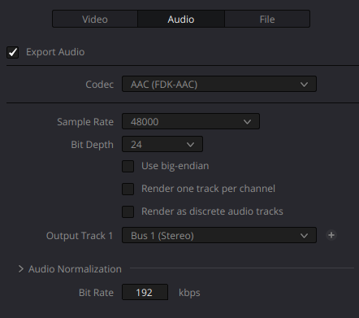

# AAC Audio Encoder Plugin for DaVinci Resolve Studio (Linux)

A high-quality AAC audio encoder plugin for DaVinci Resolve Studio on Linux, using the Fraunhofer FDK-AAC library.
Thanks to 'toxblh' for the the original concept.

Please don't ask for AAC or other input plugins. BlackMagic have disabled the option of making input plugins for commercial and licensing reasons and I respect their decision to do that. If you are looking for a quick way to import mp4 with AAC I recommend a small script I created which adds a right click in file explorer Nemo which does a quick transcode of the AAC to FLAC and remuxes with the pass-through AVC video, it is the only option at this point. I will put that in another repo.

[](https://www.gnu.org/licenses/gpl-3.0)

## Features

- ✅ **High-quality AAC encoding** using Fraunhofer FDK-AAC
- ✅ **MP4, MOV, and MKV container support**
- ✅ **Selectable bitrate** (96/128/160/192/224/256/320 kbps, default 192)
- ✅ **Multiple sample rates** (44.1 kHz, 48 kHz)
- ✅ **16-bit PCM input**
- ✅ **Native DaVinci Resolve integration**

## Screenshots


*AAC codec available in audio settings*

## Requirements

### Essential
- **DaVinci Resolve Studio** (version 18.0 or later)
  - ⚠️ **Note**: The free version does NOT support plugins
- **Linux x86-64** (Ubuntu, Debian, Arch, Fedora, etc.)
- **Root/sudo access** for installation

### Build Dependencies
- `clang++` or `g++` (C++11 support)
- `pkg-config`
- `libfdk-aac-dev` (Fraunhofer FDK-AAC library)
- DaVinci Resolve Developer SDK (included with Studio)

## Installation

### Quick Install (Recommended)

```bash
# 1. Clone the repository
git clone https://github.com/hexitnz/Resolve-Linux-Studio-AAC-FDK-Encoder-plugin.git
cd Resolve-Linux-Studio-AAC-FDK-Encoder-plugin

# 2. Run the automated installer
chmod +x install.sh
./install.sh
```

The installer will:
- Check for all dependencies
- Install missing packages (with your permission)
- Build the plugin
- Install to DaVinci Resolve
- Verify the installation

### Manual Installation

<details>
<summary>Click to expand manual installation steps</summary>

#### 1. Install Dependencies

**Ubuntu/Debian/Linux Mint:**
```bash
sudo apt update
sudo apt install build-essential pkg-config libfdk-aac-dev clang
```

**Arch Linux:**
```bash
sudo pacman -S base-devel clang libfdk-aac
```

**Fedora:**
```bash
sudo dnf install clang make pkgconfig libfdk-aac-devel
```

#### 2. Build the Plugin

```bash
cd src
make clean
make
```

#### 3. Install to DaVinci Resolve

```bash
sudo make install
```

Or manually:
```bash
sudo cp -r aac_fdk_plugin.dvcp.bundle /opt/resolve/IOPlugins/
sudo chmod -R 755 /opt/resolve/IOPlugins/aac_fdk_plugin.dvcp.bundle
```

</details>

### Post-Installation

**Restart DaVinci Resolve completely:**
```bash
killall resolve
/opt/resolve/bin/resolve
```

## Usage

1. Open **DaVinci Resolve Studio**
2. Go to the **Deliver** page
3. Select your export settings:
   - **Format:** MP4 (or MOV/MKV)
   - **Codec (Video):** Your choice (H.264, H.265, etc.)
   - **Codec (Audio):** **AAC (FDK-AAC)** ← This is the plugin!
   - **Audio Bitrate:** 96-320 kbps (dropdown, default 192)
4. Add to render queue and export

## Troubleshooting

### Plugin doesn't appear in codec list

**Check installation:**
```bash
ls -la /opt/resolve/IOPlugins/aac_fdk_plugin.dvcp.bundle/Contents/Linux-x86-64/
```

**Verify DaVinci Resolve Studio:**
- The free version does NOT support plugins
- Make sure you have the Studio version installed

**Restart Resolve completely:**
```bash
killall -9 resolve
/opt/resolve/bin/resolve
```

### Build fails with "fdk-aac not found"

**Install libfdk-aac:**
```bash
# Ubuntu/Debian
sudo apt install libfdk-aac-dev

# Arch
sudo pacman -S libfdk-aac

# Fedora (may need RPM Fusion repositories)
sudo dnf install libfdk-aac-devel
```

**Verify installation:**
```bash
pkg-config --modversion fdk-aac
```

### Audio is choppy or distorted

This usually indicates a mismatch between input format and plugin expectations.

**Try these settings in Resolve:**
- Set your Project Settings → Fairlight audio output to Stereo (this plugin only supports 2.0 stereo output)
- Set timeline audio format to 48 kHz (44.1 kHz is also supported)
- Use 16-bit audio (24-bit/float PCM input is converted internally, but the plugin currently only accepts a 16-bit pIOPropBitDepth negotiation)
- Restart the export

**Check logs:**
```bash
tail -f ~/.local/share/DaVinciResolve/logs/davinci_resolve.log | grep "AAC"
```

### Permission denied errors

**Fix permissions:**
```bash
sudo chown -R root:root /opt/resolve/IOPlugins/aac_fdk_plugin.dvcp.bundle
sudo chmod -R 755 /opt/resolve/IOPlugins/aac_fdk_plugin.dvcp.bundle
```

### No audio in exported file

**Verify the plugin is being used:**
```bash
# Start Resolve from terminal
/opt/resolve/bin/resolve 2>&1 | grep "AAC Plugin"
```

You should see messages like:
```
AAC Encoder :: Constructor
AAC Plugin :: Init - 48000 Hz, 2 ch, 16-bit, 192 kbps
AAC Plugin :: Time base declared as 1/48000 (sample-accurate PTS/Duration)
AAC Plugin :: AudioSpecificConfig forwarded to muxer (2 bytes)
AAC Plugin :: Opened - 192 kbps CBR, 2.0 stereo, frame size: 1024, inputChannels confirmed: 2
```

If you don't see these messages, the plugin isn't loading.

### Plays fine on Linux/VLC but no audio in QuickTime (macOS)

Exported files play correctly in VLC and report correct stream properties
with `ffprobe`, but have **no audio** when opened in QuickTime Player on
macOS.

This is a known issue and appears to sit outside what the codec plugin can
control. The actual AAC audio data is correct -- `ffprobe` reads the codec
configuration directly from the bitstream and confirms valid AAC-LC at the
expected sample rate/channels, and VLC plays it back correctly in sync.
The most likely explanation is that **Resolve's own internal MP4 muxer**
(which assembles the final `moov`/`esds`/`stsd` boxes from what the plugin
provides) writes container metadata that's complete enough for VLC's and
ffprobe's more lenient parsing, but not strict enough for QuickTime's
AVFoundation-based demuxer, which is historically pickier about MP4 box
structure. This is not something the `IPluginCodecRef` plugin interface
gives this codec direct control over.

**Workaround:** remux (or remux+re-encode) the exported file with `ffmpeg`,
which rewrites the container cleanly:

```bash
# Re-encode audio and rewrite the container (known to work):
ffmpeg -i "input.mp4" -c:v copy -c:a aac -b:a 320k -movflags +faststart "output.mp4"

# Or, lossless remux only (no audio re-encode, try this first):
ffmpeg -i "input.mp4" -c copy -movflags +faststart "output.mp4"
```

`-movflags +faststart` relocates and rewrites the `moov` atom via ffmpeg's
own muxer, which appears to resolve the QuickTime compatibility issue.

If you can compare `mp4box -info` (or `ffprobe -show_streams -show_format
-print_format json`) output between a Resolve-exported file and an
ffmpeg-remuxed one and spot the specific field that differs, please open
an issue with the diff -- that would help pin down exactly what Resolve's
muxer is doing differently.

## Uninstallation

```bash
sudo rm -rf /opt/resolve/IOPlugins/aac_fdk_plugin.dvcp.bundle
```

Then restart DaVinci Resolve.

## Technical Details

### Architecture

The plugin uses:
- **FDK-AAC**: Fraunhofer's high-quality AAC encoder
- **DaVinci Resolve CodecPlugin API**: Official plugin interface
- **Ring buffer**: Accumulates samples to match encoder frame size (1024 samples)
- **Format conversion**: Converts 16-bit PCM to float planar, then to int16 for FDK-AAC

### Audio Pipeline

```
Resolve (16-bit PCM, stereo)
    ↓
Plugin (convert to float planar)
    ↓
Ring Buffer (accumulate 1024 samples)
    ↓
FDK-AAC (encode to AAC)
    ↓
MP4 Muxer (write to file)
```

### Supported Formats

| Parameter | Values |
|-----------|--------|
| Containers | MP4, MOV, MKV |
| Sample Rates | 44100 Hz, 48000 Hz |
| Bit Depths | 16-bit PCM |
| Channels | Stereo (2) only |
| Bitrates | 96-320 kbps |
| Profile | AAC-LC (Low Complexity) |

## Development

### Building for Development

```bash
# Build with debug symbols
cd src
make clean
make CXXFLAGS="-std=c++11 -fPIC -g -Wall -I. -Iinclude"
```

### Project Structure

```
davinci-aac-fdk-plugin/
├── src/
│   ├── aac_encoder.cpp      # Main encoder implementation
│   ├── aac_encoder.h        # Header file
│   ├── plugin.cpp           # Plugin registration
│   ├── plugin.h             # Plugin header
│   ├── wrapper/             # SDK wrapper files
│   ├── include/             # SDK include files
│   └── Makefile            # Build configuration
├── install.sh               # Automated installer
├── README.md               # This file
├── LICENSE                 # GPL v3 license
└── docs/
    ├── BUILDING.md         # Detailed build instructions
    ├── TROUBLESHOOTING.md  # Common issues and solutions
    └── images/             # Screenshots
```

### Contributing

Contributions are welcome! Please:

1. Fork the repository
2. Create a feature branch (`git checkout -b feature/improvement`)
3. Commit your changes (`git commit -am 'Add new feature'`)
4. Push to the branch (`git push origin feature/improvement`)
5. Create a Pull Request

**Areas for contribution:**
- Support for more Linux distributions
- Additional audio formats (surround sound)
- Improved error handling
- Better documentation
- Testing on different DaVinci Resolve versions

## Known Limitations

- **Studio only**: Free version of DaVinci Resolve does not support plugins
- **Audio only**: This is an audio encoder plugin (video must use built-in codecs)
- **Stereo only**: Currently supports 2.0 stereo only (no mono, no 5.1/7.1)
- **Linux only**: This plugin is for Linux; Windows/macOS would need separate implementations
- **QuickTime playback**: Exported files may have no audio when opened directly in QuickTime Player on macOS, despite playing correctly in VLC/ffprobe -- this appears to be a Resolve MP4-muxer compatibility issue rather than a codec issue. See [Troubleshooting](#plays-fine-on-linuxvlc-but-no-audio-in-quicktime-macos) for a remux workaround.

## FAQ

**Q: Why FDK-AAC instead of FFmpeg's native AAC encoder?**  
A: FDK-AAC produces significantly higher quality audio, especially at lower bitrates. It's considered one of the best AAC encoders available.

**Q: Does this work with DaVinci Resolve Free?**  
A: No. The free version does not support third-party plugins.

**Q: What bitrate should I use?**  
A: For most purposes:
- 128 kbps: Acceptable quality
- 192 kbps: Good quality (recommended)
- 256 kbps: High quality
- 320 kbps: Maximum quality

**Q: Can I use this for commercial projects?**  
A: Yes. The plugin is GPL v3, and FDK-AAC is available for use. Check your local laws regarding AAC patents.

**Q: Why is the audio stream showing as "AAC LTP" / "64.0 kHz" in MediaInfo instead of "AAC LC" / "48.0 kHz"?**  
A: This is a known MediaInfo display quirk, not an encoding defect. The plugin always encodes AAC-LC at the sample rate you set (44.1/48 kHz). You can confirm the real stream properties independently with `ffprobe`:
```
ffprobe -v error -show_entries stream=codec_name,sample_rate,channels,channel_layout,bit_rate -of default=noprint_wrappers=1 yourfile.mp4
```
which reads the codec configuration directly from the bitstream rather than relying on MediaInfo's heuristics, and will correctly report `codec_name=aac`, your real sample rate, and `channel_layout=stereo`.

## Acknowledgments

- **Fraunhofer IIS** for the FDK-AAC library
- **Blackmagic Design** for DaVinci Resolve and the plugin SDK
- **toxblh** for the [davinci-linux-aac-codec](https://github.com/Toxblh/davinci-linux-aac-codec) project that demonstrated the plugin architecture
- The open-source community for testing and feedback

## License

This project is licensed under the GNU General Public License v3.0 - see the [LICENSE](LICENSE) file for details.

## Support

- **Issues**: [GitHub Issues](https://github.com/hexitnz/Resolve-Linux-Studio-AAC-FDK-Encoder-plugin/issues)
- **Discussions**: [GitHub Discussions](https://github.com/hexitnz/Resolve-Linux-Studio-AAC-FDK-Encoder-plugin/discussions)

## Changelog

See [CHANGELOG.md](CHANGELOG.md) for full details.

### Version 1.1.0 (2026-06-20)
- Fixed channel negotiation bug that could produce 4-channel (LCRS) output instead of stereo
- Fixed MP4 track timing/`esds` metadata (correct time base + AudioSpecificConfig forwarding)
- Fixed selected bitrate not reliably reaching the exported file
- Bitrate is now a combobox (96-320 kbps, default 192)
- Locked to 16-bit PCM input, 2.0 stereo only
- `install.sh` now builds from `src/` instead of an embedded copy

### Version 1.0.0 (2025-10-27)
- Initial release
- AAC-LC encoding with FDK-AAC
- Support for MP4, MOV, MKV containers
- Configurable bitrate (96-320 kbps)
- 16-bit and 24-bit audio support

---

**Made with ❤️ for the DaVinci Resolve Linux community**
